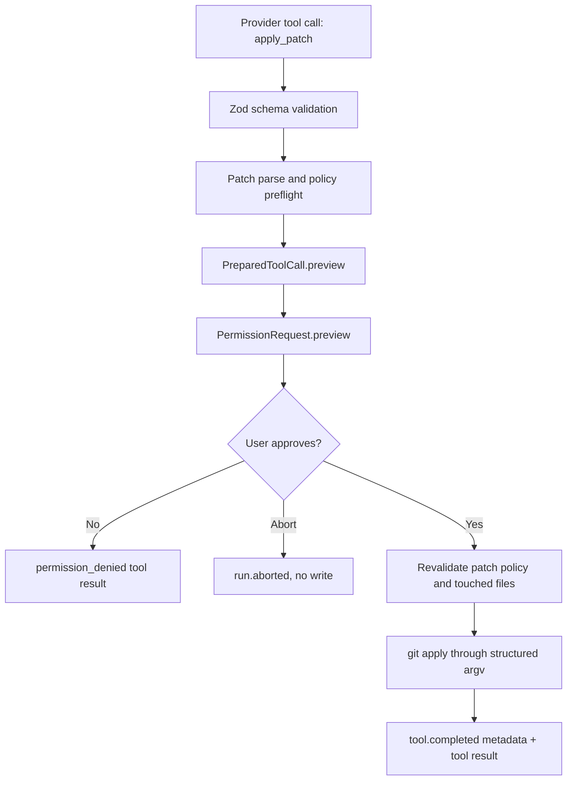

# v0.2 Patch-capable Agent 架构

## 目标

v0.2 在 v0.1 的只读 agent loop 上增加一个受控写入闭环：agent 可以提出
unified diff，但只有在工具预检通过、CLI 展示 preview、用户明确批准、执行前
再次校验后，patch 才能写入工作区。

## 运行流

## 模块边界

| Module                             | Responsibility                                                                                     |
| ---------------------------------- | -------------------------------------------------------------------------------------------------- |
| `packages/core/src/types.ts`       | 定义 `ToolPreview`、preview-bearing permission contract、`patch_policy_violation`。                |
| `packages/core/src/agent-loop.ts`  | 将 `PreparedToolCall.preview` 传入 permission gate，并在 trace 中只记录 bounded preview metadata。 |
| `packages/tools/src/patch-tool.ts` | 解析 unified diff，执行 path/secret/binary/dirty/size/applicability policy，并在批准后应用 patch。 |
| `packages/tools/src/registry.ts`   | 在 prepare 和 execute 两个阶段运行 policy，确保批准后仍会重检。                                    |
| `apps/cli/src/App.tsx`             | 渲染 patch preview summary、truncated diff body 和 approve/deny prompt。                           |

## 安全边界

`apply_patch` 是 v0.2 唯一新增写入能力。它不通过 `run_command` 开放写命令，
不 stage、commit、push，不实现 sandbox，不保存 persistent approval memory，也不
引入 MCP 或 product-level subagents。

deterministic deny 包括：

- patch path escapes repo root;
- symlink escape;
- secret-looking path;
- binary、mode、symlink、rename 或 copy patch metadata;
- patch 过大或涉及 files 过多;
- dirty touched files;
- non-applicable hunks.

## 实现取舍

当前实现复用 Git 的 patch applicability 和 atomic apply 语义，但调用方式是
`packages/tools` 内部的结构化 argv，不暴露给模型作为 shell 写命令。这样能在
v0.2 范围内交付可审查 diff 和显式批准，同时避免提前引入 sandbox、worktree
adapter、auto-commit 或 PR automation。
