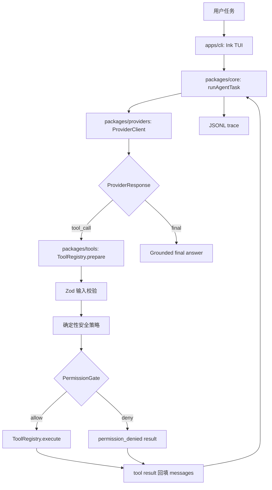

# v0.1.0 Minimal Coding Agent

## 摘要

`v0.1.0` 交付一个可运行、终端优先、只读的 coding-agent harness。它能接收用户任务，通过经过校验的仓库检查工具读取真实代码库，生成基于已检查文件的最终回答，并写出 JSONL trace 供调试和后续评估使用。

这个版本的目标不是做完整自动编程平台，而是先证明最小安全闭环：

```txt
User Task -> Agent Loop -> Tool Calling -> Safe Repo Read -> Grounded Final Response -> JSONL Trace
```

## 功能清单

| 功能                     | 用户价值                                                     | 关键入口                                                                 | 限制                                            |
| ------------------------ | ------------------------------------------------------------ | ------------------------------------------------------------------------ | ----------------------------------------------- |
| Ink TUI                  | 在终端输入任务、查看事件、处理权限提示和终止运行。           | `apps/cli/src/App.tsx`                                                   | 仅覆盖本地交互，不提供 IDE 扩展。               |
| Agent loop               | 驱动 provider 调用、工具调用、权限检查、结果回填和最终回答。 | `packages/core/src/agent-loop.ts`                                        | 默认最多 8 步，不做后台任务。                   |
| 安全只读工具             | 支持列文件、读文本文件、搜索仓库、查看 git 状态和受限命令。  | `packages/tools/src/read-tools.ts`; `packages/tools/src/command-tool.ts` | 不提供写入、patch 或任意 shell。                |
| 严格工具校验             | 模型生成的工具输入必须通过 Zod 和 JSON Schema 契约。         | `packages/tools/src/registry.ts`; `packages/core/src/types.ts`           | 未知字段和非法类型会返回结构化错误。            |
| OpenAI provider boundary | 先接入 OpenAI，同时保留 provider-neutral core contract。     | `packages/providers/src/openai-provider.ts`                              | Anthropic 只保留边界 stub。                     |
| JSONL trace              | 记录 run、provider、permission、tool 和完成事件。            | `packages/core/src/event-logger.ts`                                      | trace 会脱敏，但不是完整观测平台。              |
| 本地 CLI bundle          | `bun run build` 产出 `dist/agent-harness.js`。               | `package.json`; `apps/cli/src/main.tsx`                                  | 运行 bundle 仍需要 `bun install` 后的依赖环境。 |

## 本次变更图



## 关键逻辑和代码定义

| 逻辑         | 代码定义                                                                           | 位置                                 | 说明                                                                         |
| ------------ | ---------------------------------------------------------------------------------- | ------------------------------------ | ---------------------------------------------------------------------------- |
| 运行入口     | `runAgentTask`                                                                     | `packages/core/src/agent-loop.ts`    | 创建 run state，循环调用 provider，处理 tool call 和 final response。        |
| 核心契约     | `ProviderClient`, `ToolRegistry`, `ToolDefinition`, `PermissionGate`, `TraceEvent` | `packages/core/src/types.ts`         | 定义 provider-neutral 的消息、工具、权限和事件形状。                         |
| 权限处理     | `resolvePermission`                                                                | `packages/core/src/agent-loop.ts`    | `allow` 直接执行，`ask` 进入 CLI permission gate，非 allow 统一变成 deny。   |
| 工具预检     | `DefaultToolRegistry.prepare`                                                      | `packages/tools/src/registry.ts`     | 先查找工具，再做 Zod 校验和确定性 policy 检查；失败不会进入权限或执行。      |
| 工具执行     | `DefaultToolRegistry.execute`                                                      | `packages/tools/src/registry.ts`     | 重新校验输入和 policy，确认权限后执行工具。                                  |
| 默认工具集   | `createDefaultToolRegistry`                                                        | `packages/tools/src/index.ts`        | 注册 `list_files`、`read_file`、`search_repo`、`git_status`、`run_command`。 |
| 只读文件工具 | `listFilesTool`, `readFileTool`, `searchRepoTool`, `gitStatusTool`                 | `packages/tools/src/read-tools.ts`   | 通过安全路径、文本判断和输出上限控制仓库读取。                               |
| 命令工具     | `runCommandTool`                                                                   | `packages/tools/src/command-tool.ts` | 使用 argv 和 allowlist，只允许有限只读命令，并拒绝 shell token。             |
| 事件日志     | `createJsonlEventLogger`, `redactTraceEvent`                                       | `packages/core/src/event-logger.ts`  | 写 JSONL trace，并对 secret-like key/value 脱敏。                            |
| TUI 适配     | `App`                                                                              | `apps/cli/src/App.tsx`               | 连接 mock/live provider、工具注册表、权限提示、终止输入和 trace logger。     |

核心 loop 的简化形态：

```ts
const response = await provider.generate(providerRequest);

if (response.type === "final") {
  state.status = "completed";
  state.finalAnswer = response.content;
  return state;
}

for (const call of response.calls) {
  const preflight = await input.tools.prepare(call, createToolContext(...));
  const permission = await resolvePermission(...);
  const result = await input.tools.execute(call, createToolContext(...));
  appendToolResult(state, result);
}
```

## 为什么这样实现

| 决策                     | 未采用方案                 | 原因                                                                            |
| ------------------------ | -------------------------- | ------------------------------------------------------------------------------- |
| v0.1 只读                | v0.1 直接支持 edit/patch   | 先验证 agent loop、工具协议、权限和 trace，避免在写入能力尚未稳定时扩大风险面。 |
| 内部工具协议             | v0.1 直接以 MCP 为核心协议 | 当前目标是最小 runtime contract；MCP 可以作为后续集成层，而不是第一版核心依赖。 |
| 工具驱动 repo inspection | 启动时预加载全仓或建索引   | 工具读取更容易控制安全边界、上下文预算和最终回答 grounding。                    |
| OpenAI first             | 同时完整接入多 provider    | 先验证 provider boundary，避免第一版把精力分散到多个 SDK 差异。                 |
| JSONL trace              | 直接上数据库或完整观测系统 | JSONL 足够可检查、可 diff、可用于后续 eval，复杂度低。                          |
| 命令 allowlist           | 让用户批准任意命令         | 权限批准不能覆盖确定性安全策略；危险或写入命令在代码层拒绝。                    |

## 行业方案对照

| 项目         | 公开方案                                                                               | 我们的方案                                                               | 原因                                                           |
| ------------ | -------------------------------------------------------------------------------------- | ------------------------------------------------------------------------ | -------------------------------------------------------------- |
| OpenAI Codex | 使用 `AGENTS.md`、项目配置、rules、hooks、skills、subagents、sandbox/approval policy。 | 开发工作流可借鉴 Codex 项目规则，但 v0.1 产品内核不做 subagents 或 MCP。 | v0.1 先固定只读 harness 内核，避免把开发助手能力误当产品能力。 |
| Claude Code  | 使用 `CLAUDE.md` memory、permission modes、hooks、自定义 subagents 和工具权限。        | 采用显式 `allow/ask/deny` 权限模型，但不引入隐藏 memory。                | 明确权限和无 memory 能减少第一版行为不可解释性。               |
| opencode     | 终端优先，支持 primary/subagent 和 per-agent 权限。                                    | 终端优先方向一致；v0.1 保持单 agent loop。                               | 多 agent 和 mode 分离留给后续 release，当前先验证单 loop。     |
| OpenClaw     | 强调个人 AI 助手、多 agent routing、skills、first-class tools、session/sandbox 运行。  | 不做个人助理或多通道路由，只做 repo 内 coding-agent harness。            | 项目定位不同；本项目优先真实仓库检查和工程可验证性。           |
| Hermes Agent | 长运行 agent 平台，包含工具、技能、memory、MCP、cron、多 terminal backend 等。         | 不做 long-running/background/memory/MCP，先保留本地一次性 run。          | v0.1 的评估对象是最小安全闭环，不是完整 agent 操作系统。       |

参考来源：

- OpenAI Codex customization: https://developers.openai.com/codex/concepts/customization
- OpenAI Codex sandboxing: https://developers.openai.com/codex/concepts/sandboxing
- OpenAI Codex subagents: https://developers.openai.com/codex/subagents
- Claude Code permissions: https://code.claude.com/docs/en/permissions
- Claude Code subagents: https://code.claude.com/docs/en/sub-agents
- opencode agents: https://opencode.ai/docs/agents/
- OpenClaw README: https://github.com/openclaw/openclaw
- Hermes Agent README: https://github.com/NousResearch/hermes-agent

## 演示

```bash
bun install
bun run build
bun dist/agent-harness.js --repo fixtures/tiny-ts-repo --task "Explain this repository structure and identify the main modules."
```

开发入口仍可使用：

```bash
bun run dev -- --repo fixtures/tiny-ts-repo --task "Explain this repository structure and identify the main modules."
```

运行中可按 `q` 或 `Ctrl+C` 终止。

## 质量证据

发布前要求运行：

```bash
bun run format:check
bun run lint
bun run typecheck
bun run build
bun run test
bun run smoke
bun run quality
```

本次文档更新后的本地验证：

- v0.1 is read-only and cannot edit or patch files.
- `run_command` is intentionally restricted to a small read-only allowlist.
- The build emits a local Bun CLI bundle and externalizes runtime dependencies;
  use it after `bun install`.
- OpenAI is the first real provider. Multi-provider behavior beyond the current
  boundary remains future work.
- OpenAI provider tool results are not yet mapped through provider-native
  `tool_call_id` messages. See `docs/agent/openai-provider.md`.
- Live provider smoke requires `OPENAI_API_KEY`.
| 命令                            | 结果    | 备注                                                                          |
| ------------------------------- | ------- | ----------------------------------------------------------------------------- |
| `bun run quality`               | pass    | 2026-05-11 文档更新后通过；包含 format、lint、typecheck、build、test、smoke。 |
| `bun run smoke:live`            | skipped | `OPENAI_API_KEY` 未设置；本次没有运行 live provider smoke。                   |
| `bun dist/agent-harness.js ...` | pass    | v0.1 release candidate 曾使用 `fixtures/tiny-ts-repo` 验证本地 bundle 入口。  |
| `bun run dev -- ...`            | pass    | v0.1 release candidate 曾使用 `fixtures/tiny-ts-repo` 验证开发入口。          |

## 已知限制

- v0.1 是只读版本，不能编辑或 patch 文件。
- `run_command` 只允许很小的只读命令 allowlist。
- OpenAI 是第一个真实 provider；其他 provider 只保留边界或后续空间。
- Live smoke 需要 `OPENAI_API_KEY`。
- 这个版本不提供 MCP、sandbox runtime、persistent memory、product-level subagents、eval dashboard、IDE extension 或 background task mode。

## 下一步

候选方向：

- 显式 edit/patch approval workflow。
- 更完整的 provider coverage。
- eval fixtures 和比较流程。
- 在 release scope 允许时扩展命令策略。
- 包分发和安装体验设计。

## 发布核对

The `v0.1.0` tag points to commit `1e794c2`.
- Release verification 已完成本地候选版本。
- `v0.1.0` tag 尚未创建；创建时记录最终 commit SHA。
- 从 `v0.2.0` 开始，新增发布文档必须以中文作为正文语言，并遵守 `docs/engineering/release-documentation-standard.md`。
