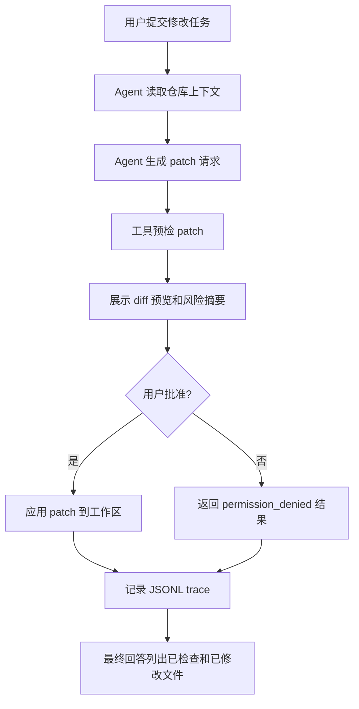

# v0.2.0 Release Contract: Patch-capable Agent

## 目标

构建一个可审查、可批准、可追踪的补丁能力，让 agent 能在真实仓库中提出代码修改，向用户展示 diff 预览，并且只在用户明确批准后应用补丁。

v0.2 的核心问题：

```txt
Can the agent safely propose and apply code changes?
```

## 用户旅程



## 范围

| 能力                               | 状态     |
| ---------------------------------- | -------- |
| Patch proposal flow                | P0       |
| Diff preview before write          | P0       |
| Explicit patch approval            | P0       |
| Safe patch application tool        | P0       |
| Patch path and secret policy       | P0       |
| Dirty touched-file protection      | P0       |
| Patch size and file-count limits   | P0       |
| JSONL trace for patch lifecycle    | P0       |
| TUI patch preview and approve/deny | P0       |
| Read-only tools retained           | P0       |
| Auto-commit                        | P1/later |
| Multi-file generated test runner   | P1/later |

## 非目标

- 自动 commit、push 或创建 PR；
- 后台写入或无人值守写入；
- sandbox runtime；
- MCP integration；
- persistent memory；
- product-level subagents；
- IDE extension；
- 任意 shell 写命令；
- 二进制 patch；
- 修改 secret-looking 文件；
- 自动解决 merge conflict。

## 功能验收

| ID   | 标准                    | 通过条件                                                                          |
| ---- | ----------------------- | --------------------------------------------------------------------------------- |
| F-01 | Existing v0.1 flow      | v0.1 read/search/git status/final answer/trace 行为保持通过。                     |
| F-02 | Patch tool registered   | 默认工具集中存在一个写入能力受控的 patch 工具。                                   |
| F-03 | Patch proposal          | provider 可以请求 patch 工具并提交 unified diff。                                 |
| F-04 | Patch preflight         | patch 在写入前完成 schema、路径、secret、dirty-file、size 和 applicability 检查。 |
| F-05 | Diff preview            | TUI 在批准前展示 diffstat、文件列表、风险摘要和截断 diff 预览。                   |
| F-06 | Explicit approval       | patch 工具默认 `ask`，必须由用户批准后才能写入。                                  |
| F-07 | Denial path             | 用户拒绝时不修改工作区，并向模型上下文追加结构化 denied result。                  |
| F-08 | Apply path              | 用户批准且预检通过时，patch 应用到工作区。                                        |
| F-09 | Modified-file reporting | 最终回答列出修改文件和未运行的验证项。                                            |
| F-10 | Trace                   | trace 记录 patch requested、approved/denied、applied/failed 等事件。              |
| F-11 | Abort                   | 用户在 patch approval 等待期间 abort 时，不得写入。                               |

## 安全验收

| ID   | 标准                | 通过条件                                                               |
| ---- | ------------------- | ---------------------------------------------------------------------- |
| S-01 | Path traversal      | patch 路径不能逃逸 repo root。                                         |
| S-02 | Symlink escape      | patch 不能通过 symlink 修改 repo 外部目标。                            |
| S-03 | Secret files        | `.env`、`.pem`、`.key`、private key 等 secret-looking 路径拒绝修改。   |
| S-04 | Binary patch        | binary diff、mode change、symlink change 默认拒绝。                    |
| S-05 | Dirty touched files | patch 涉及的文件已有未提交修改时拒绝，避免覆盖用户工作。               |
| S-06 | Patch applicability | 写入前必须有 clean preflight；不可应用的 patch 不得部分写入。          |
| S-07 | Atomicity           | 单个 patch 任一 hunk 失败时，不得留下部分应用结果。                    |
| S-08 | Output bounds       | diff preview、trace metadata 和 tool result 必须有大小上限和截断标记。 |
| S-09 | Permission boundary | 用户批准不能覆盖路径、secret、binary、dirty-file 或 size policy。      |
| S-10 | No shell writes     | 不通过任意 shell string 执行写命令。                                   |
| S-11 | No hidden commit    | patch apply 不得自动 stage、commit、push。                             |
| S-12 | Redaction           | trace 不记录 secret 内容或完整大 diff。                                |

## 工程验收

```bash
bun run format:check
bun run lint
bun run typecheck
bun run build
bun run test
bun run smoke
bun run quality
```

全部必须在发布前通过。

## 文档验收

- `docs/research/v0.2/edit-patch-approval-workflow.md` 已完成；
- `docs/specs/v0.2/edit-patch-approval-workflow.md` 已完成；
- `docs/checklists/v0.2-readiness-gap-list.md` 无 open P0 blocker；
- `docs/releases/v0.2.0.md` 按 `docs/engineering/release-documentation-standard.md` 编写；
- README、architecture、tool protocol、permission system、testing strategy 在实现后同步更新。
