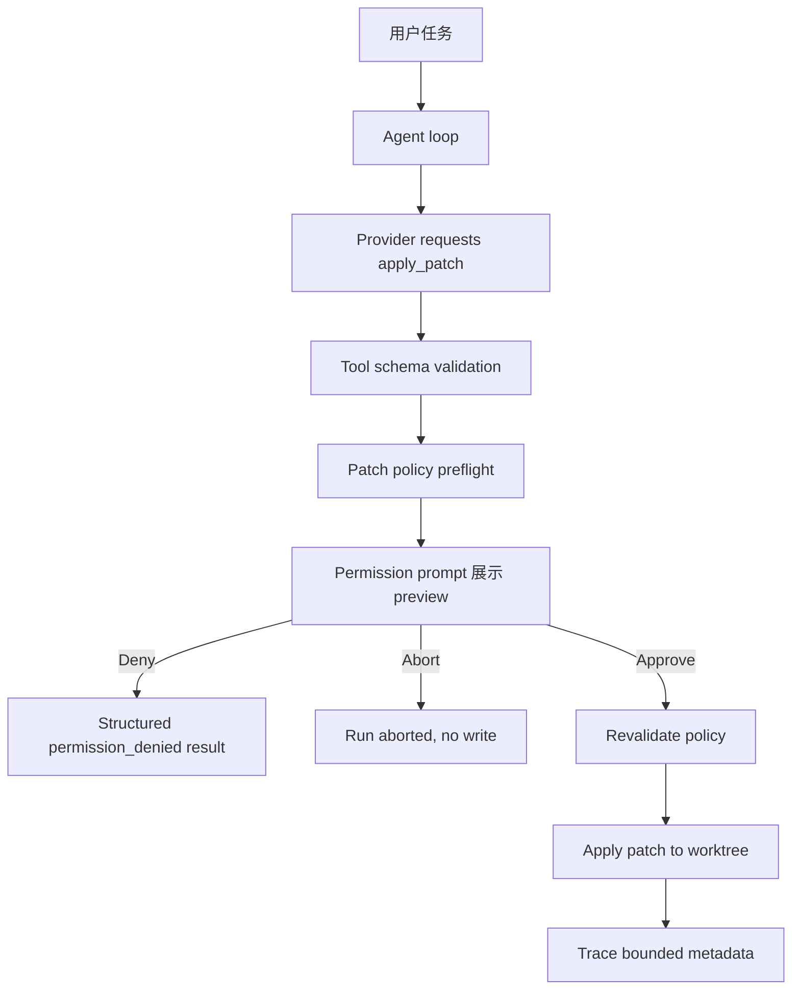

# v0.2.0 Patch-capable Agent 发布说明

## 摘要

v0.2.0 让 harness 从只读仓库检查扩展到受控 patch 写入：agent 可以提交
unified diff，工具层先完成确定性预检，CLI 在写入前展示 diff preview，用户
明确批准后才会写入工作区。该版本不自动 stage、commit、push，也不引入
sandbox、MCP、persistent memory、background write 或 product-level subagents。

## 功能清单

| 功能               | 用户价值                                                                      | 限制                                                                | 关键证据                                            |
| ------------------ | ----------------------------------------------------------------------------- | ------------------------------------------------------------------- | --------------------------------------------------- |
| `apply_patch` 工具 | agent 可以提出并应用小型文本 patch                                            | 只支持普通文本 unified diff                                         | `packages/tools/src/patch-tool.ts`                  |
| Diff preview       | 用户在写入前看到文件列表、diffstat、风险和截断 diff                           | preview 有大小上限                                                  | `ToolPreview`; `apps/cli/src/App.tsx`               |
| 显式批准           | 默认 `ask`，拒绝或 abort 不写入                                               | 不持久化 approval                                                   | `packages/core/src/agent-loop.ts`                   |
| Patch policy       | 拒绝 path traversal、secret path、binary/mode/symlink、dirty file、stale hunk | 不自动修复冲突                                                      | `packages/tools/test/tools.test.ts`                 |
| Trace metadata     | permission/tool trace 包含 bounded preview/result metadata                    | 不记录完整大 diff                                                   | `packages/core/test/agent-loop.test.ts`             |
| Provider boundary  | deterministic provider 可以提出 patch tool call                               | live OpenAI tool-result mapping 仍非 provider-native `tool_call_id` | `docs/agent/openai-provider.md`; `scripts/smoke.ts` |

## Feature 验收卡

| Feature               | 用户需求 / 主场景                                                                                    | Industry practice                                                                                      | 本项目方案                                                                           | Why                                                                          | How                                                                                                                                 | E2E acceptance                                                                        | Benchmark                                                                                                                                   |
| --------------------- | ---------------------------------------------------------------------------------------------------- | ------------------------------------------------------------------------------------------------------ | ------------------------------------------------------------------------------------ | ---------------------------------------------------------------------------- | ----------------------------------------------------------------------------------------------------------------------------------- | ------------------------------------------------------------------------------------- | ------------------------------------------------------------------------------------------------------------------------------------------- |
| Controlled text patch | 用户希望 agent 能修改真实仓库，但不能绕过审查或覆盖本地工作。主要场景是本地 repo 中的小型文本 diff。 | Codex、Claude Code、opencode 都强调权限边界；Aider 强调编辑模式；OpenHands 常用 sandbox 降低执行风险。 | v0.2 只新增 `apply_patch`，默认 `ask`，不扩大 `run_command`，不宣称 sandbox。        | 当前主要需求是可审查、可拒绝、可追踪的最小写入闭环，而不是无人值守自动开发。 | `packages/tools/src/patch-tool.ts` 做 parse/preflight/apply；`packages/tools/src/registry.ts` 在 prepare 和 execute 都运行 policy。 | `scripts/smoke.ts` 覆盖 provider 提出 patch、preview approval、写入、最终回答。       | safety matrix 覆盖 invalid、traversal、secret、binary/mode/symlink、dirty、non-applicable、too-large、no approval、no hidden stage/commit。 |
| Diff preview approval | 用户批准前必须知道将改哪些文件、风险是什么、diff 是否被截断。主要场景是 TUI 中审批 patch。           | 权限型 coding agent 通常把危险工具放入 approval gate；成熟系统还会结合 workspace/sandbox。             | 工具层生成 `ToolPreview`，core 传给 permission gate，CLI 只渲染 preview 和收集决定。 | preview 不能由 CLI 从 raw input 猜测，否则工具协议和安全策略会分裂。         | `ToolPreview`、`PreparedToolCall.preview`、`PermissionRequest.preview` 组成公共契约。                                               | core test 验证 preview 到 permission/trace；CLI 渲染 summary/body/truncation marker。 | trace benchmark 要求 bounded preview metadata，不记录完整 raw diff。                                                                        |

## 变更图

## 关键逻辑和代码位置

| 位置                               | 定义                                                                                             | 用途                                                              |
| ---------------------------------- | ------------------------------------------------------------------------------------------------ | ----------------------------------------------------------------- |
| `packages/core/src/types.ts`       | `ToolPreview`, `PermissionRequest.preview`, `PreparedToolCall.preview`, `patch_policy_violation` | v0.2 preview 和错误边界公共契约                                   |
| `packages/core/src/agent-loop.ts`  | `resolvePermission`, `emitToolCompleted`                                                         | 把 preview 传给 permission gate，并把 bounded metadata 写入 trace |
| `packages/tools/src/registry.ts`   | `DefaultToolRegistry.prepare`, `DefaultToolRegistry.execute`                                     | prepare 和 execute 阶段都运行 policy，实现批准前预检和批准后重检  |
| `packages/tools/src/patch-tool.ts` | `applyPatchTool`                                                                                 | patch parse、policy、preview、`git apply --check`、`git apply`    |
| `apps/cli/src/App.tsx`             | permission prompt rendering                                                                      | 展示 preview summary、diff body、truncation marker、approve/deny  |

## 实现原因

本版本选择单一 `apply_patch` 工具，而不是扩展 `run_command` 或加入
`write_file`。原因是 unified diff 能被用户审查，并且可以在工具层统一做
path、secret、binary、dirty-file、size 和 applicability policy。使用结构化
`git apply --check`/`git apply` 可以复用 Git 的 hunk 语义和原子性，但模型
无法获得任意 shell 写命令。

拒绝的替代方案：

- prompt-only approval：无法保证工具层不写；
- `run_command git apply`：扩大 shell/argv 风险，弱化 patch-specific policy；
- `write_file` 整文件覆盖：缺少上下文 hunk 匹配，第一版更容易覆盖用户工作；
- auto-commit/PR：需要 git write、remote 和 GitHub 集成，超出 v0.2。

## 行业方案对照

| 项目         | 外部方案                                    | 本项目选择                                                   | 取舍                              |
| ------------ | ------------------------------------------- | ------------------------------------------------------------ | --------------------------------- |
| OpenAI Codex | 强调 workspace、sandbox、approval boundary  | v0.2 只交付 patch policy + approval，不宣称 sandbox          | 保持 scope 小，后续再引入 sandbox |
| Claude Code  | permissions 可控制工具和命令                | `apply_patch` 默认 `ask`，approval 不能覆盖 policy deny      | 延续显式权限边界                  |
| opencode     | permissions 可细分到 tool/bash pattern      | 写入能力作为明确 tool，不扩大 `run_command` allowlist        | 避免 shell 写面扩大               |
| Aider        | architect/editor 模式区分计划和编辑         | 保持 single-agent loop，但工具层区分 preflight/preview/apply | 不引入多 agent 或 editor mode     |
| OpenHands    | 使用 sandbox 降低执行风险                   | v0.2 不实现 sandbox，改用保守 patch policy                   | 安全能力较窄但可测试              |
| Hermes Agent | 平台化组合 tools、skills、memory、MCP、cron | v0.2 不引入平台能力                                          | 保持 release contract 聚焦        |

## 质量证据

| Command                                                                            | Result                                                        |
| ---------------------------------------------------------------------------------- | ------------------------------------------------------------- |
| `bun test packages/tools/test/tools.test.ts packages/core/test/agent-loop.test.ts` | pass                                                          |
| `bun run format:check`                                                             | pass                                                          |
| `bun run lint`                                                                     | pass                                                          |
| `bun run typecheck`                                                                | pass                                                          |
| `bun run build`                                                                    | pass                                                          |
| `bun run test`                                                                     | pass                                                          |
| `bun run smoke`                                                                    | pass                                                          |
| `bun run quality`                                                                  | pass                                                          |
| `bun run smoke:live`                                                               | not run；optional live provider smoke 需要 `OPENAI_API_KEY`。 |

## E2E 验收

| 场景               | Command / steps                                  | Fixture / input                            | 预期证据                                                                                                                           | Result |
| ------------------ | ------------------------------------------------ | ------------------------------------------ | ---------------------------------------------------------------------------------------------------------------------------------- | ------ |
| Patch approval E2E | `bun run smoke`                                  | `scripts/smoke.ts` 创建 temporary git repo | provider requests `apply_patch`，permission gate sees preview，approval writes `src/index.ts`，final answer mentions modified file | pass   |
| Denial path        | `bun test packages/tools/test/tools.test.ts`     | temp git repo with `src/index.ts`          | `apply_patch` without approval returns `permission_denied`，且 file remains unchanged                                              | pass   |
| Abort path         | `bun test packages/core/test/agent-loop.test.ts` | 永不 resolve 的 permission gate            | abort stops before tool execution，并 emits aborted state                                                                          | pass   |
| Worktree boundary  | `bun test packages/tools/test/tools.test.ts`     | temp git repo 中的 approved patch          | file changes；staged diff 为空；commit count 保持不变。                                                                            | pass   |

## Benchmark

| 问题                                                                               | Metric                           | Dataset / fixture                                 | Command / artifact                                   | Threshold                                                                              | Result | Caveat                                                                       |
| ---------------------------------------------------------------------------------- | -------------------------------- | ------------------------------------------------- | ---------------------------------------------------- | -------------------------------------------------------------------------------------- | ------ | ---------------------------------------------------------------------------- |
| Harness 能否在拒绝 unsafe/stale patch scenarios 的同时应用 approved text patches？ | Required safety matrix pass rate | tool tests with temp git repos and patch fixtures | `bun test packages/tools/test/tools.test.ts`         | all required policy scenarios pass                                                     | pass   | 这是 local harness benchmark，不是 public ranking。                          |
| 同上                                                                               | End-to-end patch success         | deterministic smoke temporary repo                | `bun run smoke`                                      | provider-to-final-answer patch workflow succeeds                                       | pass   | Live OpenAI path 未 benchmark。                                              |
| Same                                                                               | Peer baseline coverage           | research note and release comparison              | `docs/research/v0.2/edit-patch-approval-workflow.md` | Codex, Claude Code, opencode, Aider, OpenHands, Hermes Agent, and Git apply considered | pass   | Competitors were compared by public practice, not executed on the same task. |

## 已知限制

- 不自动 stage、commit、push 或创建 PR；
- 不支持 binary patch、mode change、symlink patch、rename 或 copy patch；
- 不修改 secret-looking path；
- 不提供 sandbox runtime；
- 不实现 MCP、persistent memory、background write 或 product-level subagents；
- 不自动解决 merge conflict；
- live OpenAI runs 仍继承 `docs/agent/openai-provider.md` 中记录的限制：
  tool results 当前作为 plain `user` messages 回传，而不是 provider-native
  `tool_call_id` messages。

## 下一步

- 为 live provider path 增加更完整的 patch proposal smoke；
- 后续版本评估 sandbox/worktree adapter 和 PR automation。
