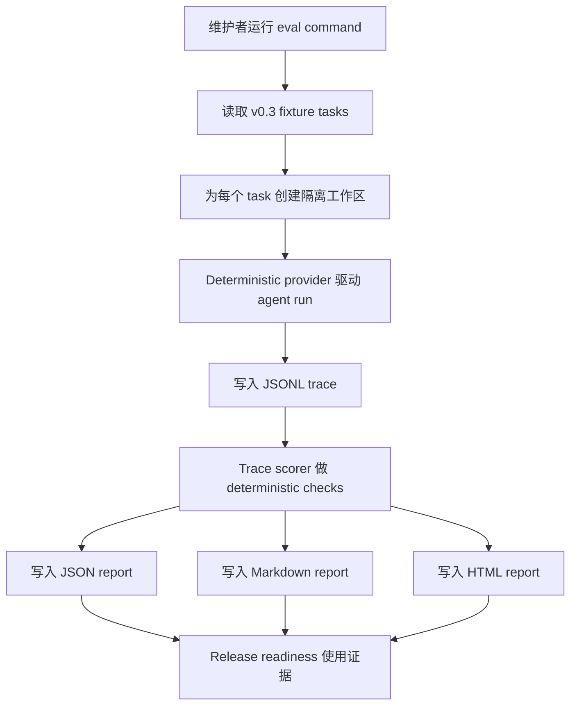

# v0.3.0 Release contract：Evaluation Harness

## Alignment brief（对齐简报）

### 问题

`v0.2.0` 已经让 agent 可以在受控权限下检查仓库并应用文本 patch，但当前 release evidence 仍分散在 unit tests、`scripts/smoke.ts`、readiness checklist 和人工 release note 中。`v0.3.0` 要回答的核心问题是：

```txt
Can behavior regressions be measured?
```

本 release 不追求通用排行榜，也不判断模型“聪明程度”。它只建立本项目自己的本地回归度量闭环：固定 fixture tasks，运行 deterministic agent runs，读取 JSONL trace，做确定性 checks，并输出本地 JSON、Markdown 和 HTML report。

### 为什么现在处理

v0.1 留下了 `fixtures/tiny-ts-repo`、mock provider、JSONL trace 和 read-only smoke。v0.2 又加入了 patch approval smoke、bounded preview metadata、permission trace 和 safety matrix。继续做 v0.4 context engineering 之前，需要先能回答“改动是否让既有行为退化”。否则后续 context、retry、memory、delegation 或 sandbox 变化都只能靠人工读日志判断风险。

### 已考虑选项

| 选项                                    | 结论     | 原因                                                                                 |
| --------------------------------------- | -------- | ------------------------------------------------------------------------------------ |
| 只扩展现有 `bun run smoke`              | 不足够   | smoke 能证明一条 happy path，但不能表达任务矩阵、逐项检查和报告证据。                |
| 引入完整 benchmark leaderboard          | 拒绝     | 会扩大到模型排名、公开服务和跨项目公平性问题，不符合 v0.3 目标。                     |
| 直接接入 SWE-bench 或大型外部 benchmark | later    | 成熟但成本高、依赖复杂，且不能先解决本项目 trace scoring 问题。                      |
| 使用 LLM judge 评估最终回答             | 暂不采用 | 第一版应优先使用 deterministic checks，避免评估结果不可复现。                        |
| 建立本地 Evaluation Harness 和 report   | 推荐     | 与现有 fixture、mock provider、trace 和 release evidence 自然衔接。                  |
| 只输出 JSON / Markdown report           | 不足够   | JSON 适合机器读取，Markdown 适合线性阅读，但 release reviewer 缺少过滤、跳转和折叠。 |
| 增加 self-contained HTML report         | 推荐     | 借鉴 `skill-hub` 的 HTML 工作报告边界，用同一数据模型补齐本地可浏览证据。            |

### 推荐方案

v0.3.0 交付一个本地、确定性、script-friendly 的 evaluation harness：

1. 固定一组 v0.3 fixture tasks，覆盖 read-only inspection、safe command denial、patch approval、patch denial 和 trace completeness。
2. 每个 task 运行一个 deterministic provider + real tool registry + isolated fixture repo。
3. 每次 run 写入 JSONL trace。
4. trace scorer 读取 JSONL，执行 schema、event sequence、tool result、permission、worktree 和 final-answer grounding checks。
5. 输出本地 JSON report、Markdown report 和 self-contained HTML report，记录 pass/fail、evidence、metrics、limitations 和未运行项。

### 取舍

- 选择 deterministic providers，不把 live model behavior 作为 v0.3 发布阻断项。
- 选择 trace scoring，不要求 agent loop 在 v0.3 先暴露新的 runtime API。
- 选择本地 report，不做 dashboard、线上服务或 leaderboard；HTML 是静态审查 artifact，不是产品 UI。
- 选择 explicit limitations，不把未运行的 live provider、peer execution 或 LLM judge 写成通过。

### planned E2E acceptance

```txt
User runs local eval command
→ harness loads fixed v0.3 task definitions
→ each task creates or copies an isolated fixture repo
→ deterministic provider drives agent loop
→ existing tools execute under current permission policy
→ JSONL traces are written
→ scorer reads traces and worktree evidence
→ local JSON/Markdown/HTML reports record pass/fail, metrics, evidence, limitations
```

### benchmark question / metrics

| Benchmark question                             | Metrics                                                                                          | Threshold for v0.3.0 release                                            |
| ---------------------------------------------- | ------------------------------------------------------------------------------------------------ | ----------------------------------------------------------------------- |
| 能否度量既有 read-only 和 patch 行为是否回归？ | task pass rate、check pass rate、required event coverage、final answer grounding                 | 所有 P0 fixture tasks 和 required checks 通过。                         |
| trace 是否足够支撑本地 scoring？               | parseable JSONL rate、required event presence、missing evidence count                            | 所有 generated trace 可解析；P0 required events 全存在。                |
| safety regression 是否能被本地报告定位？       | denial check pass rate、unexpected write count、permission prompt count、policy violation kind   | unsafe fixture 无写入；报告包含失败 task 和 evidence path。             |
| report 是否足以支持 release readiness review？ | report schema validity、Markdown/HTML section coverage、limitations coverage、HTML browser smoke | JSON、Markdown 和 HTML report 都包含结果、证据和限制；HTML 可本地打开。 |

### 验收标准

- `docs/research/v0.3/evaluation-harness.md` 记录已刷新的 industry scan，并把每个外部信号映射到 v0.3 scope。
- `docs/research/v0.3/evaluation-harness-technical-report.html` 提供自包含 HTML 技术调研报告，并明确它不是 eval 运行报告。
- `docs/specs/v0.3/evaluation-harness.md` 定义 task schema、trace scoring、report contract、错误处理、E2E plan 和 benchmark plan。
- `docs/checklists/v0.3-readiness-gap-list.md` 跟踪 implementation 前、中、后 blockers。
- 实现阶段必须补充 unit、integration、E2E 和 benchmark evidence，不能只靠 unit tests 发布。
- v0.3 不声称 live provider benchmark、peer execution ranking 或 LLM judge 结果，除非后续明确实现并运行。

### 非目标

- 不做 leaderboard。
- 不做线上服务、dashboard 或 remote report upload。
- 不做 LLM judge，除非后续 research/spec 明确证明必要并获得批准。
- 不扩大到 context engineering、memory、delegation、sandbox、MCP 或 IDE extension。
- 不接入 SWE-bench 作为 v0.3 P0。
- 不自动 tag、publish、commit、push 或 PR。

### implementation stories 建议拆分

| Story | 目标                              | 建议范围                                                                        |
| ----- | --------------------------------- | ------------------------------------------------------------------------------- |
| 1     | Eval task contract and fixtures   | 定义 task JSON schema，新增固定 fixture task definitions，补 schema tests。     |
| 2     | Trace scorer deterministic checks | 读取 JSONL trace，检查 required events、tool calls、permissions、final answer。 |
| 3     | Eval runner                       | 运行 deterministic providers、隔离 fixture repos、写 trace 和 run metadata。    |
| 4     | Local report data model           | 输出 JSON 和 Markdown report，记录 pass/fail、evidence、limitations。           |
| 5     | HTML review artifact              | 从同一 data model 渲染 self-contained HTML report，并补浏览器 smoke。           |
| 6     | Release evidence integration      | 更新 docs、readiness checklist、smoke/eval 命令和 quality gate 记录。           |

## 目标

构建一个最小可用的本地 evaluation harness，让维护者能用固定任务和 trace scoring 发现 behavior regressions。

## 用户旅程



## 范围

| Capability                        | Status |
| --------------------------------- | ------ |
| Fixed fixture task definitions    | P0     |
| Deterministic agent run execution | P0     |
| JSONL trace parsing               | P0     |
| Deterministic checks / scoring    | P0     |
| Local JSON report                 | P0     |
| Local Markdown report             | P0     |
| 本地自包含 HTML report            | P0     |
| 通过 / 失败证据和限制             | P0     |
| Live provider comparison          | P1     |
| External benchmark import         | P1     |
| LLM judge                         | P2     |
| 排行榜 / 托管服务                 | reject |

## 非目标

- 不做模型排行榜或跨项目公开排名。
- 不做线上服务、dashboard、report upload 或 cloud execution。
- 不做 LLM judge。
- 不改变 provider abstraction、permission policy、patch policy 或 TUI 行为。
- 不引入 context engineering、memory、delegation、sandbox 或 MCP。
- 不要求 API key，live provider smoke 仍为 optional。

## 功能验收

| ID   | 标准                  | 通过条件                                                                                          |
| ---- | --------------------- | ------------------------------------------------------------------------------------------------- |
| F-01 | Fixed tasks           | v0.3 task definitions 可被 schema 校验并稳定排序。                                                |
| F-02 | Eval runner           | runner 能运行全部 P0 tasks，并为每个 task 产生 run result。                                       |
| F-03 | Trace collection      | 每个 task 产生可解析 JSONL trace，且 report 记录 trace path。                                     |
| F-04 | Trace scoring         | scorer 能检查 required events、tool calls、permission 和 tool result。                            |
| F-05 | Worktree checks       | patch task 能检查 expected file content、unexpected write、stage/commit。                         |
| F-06 | Final answer checks   | inspection task 能检查 final answer grounding 到 inspected paths。                                |
| F-07 | Report output         | JSON report、Markdown report 和 HTML report 都包含 totals、task results 和 limitations。          |
| F-08 | Failure visibility    | 任一 check fail 时 report 指出 task id、check id、reason 和 evidence path。                       |
| F-09 | HTML review artifact  | HTML report 可本地打开，支持失败定位、证据浏览和至少一种过滤或折叠控件。                          |
| F-10 | Release log HTML data | HTML report 从 `CHANGELOG.md` 解析 release log，并呈现 version、date、status、sections 和 items。 |

## 安全验收

| ID   | 标准                 | 通过条件                                                                                                                               |
| ---- | -------------------- | -------------------------------------------------------------------------------------------------------------------------------------- |
| S-01 | No hidden writes     | read-only 和 denial tasks 不得修改 fixture worktree。                                                                                  |
| S-02 | Permission boundary  | unsafe command/patch tasks 不得通过 approval 绕过 policy。                                                                             |
| S-03 | Trace redaction      | scorer 不要求 raw secret 或完整大 diff，继续使用 bounded trace metadata。                                                              |
| S-04 | Local-only artifacts | report 写入本地 `.agent-harness/evals` 或指定 output path，不上传。                                                                    |
| S-05 | Fixture isolation    | 每个 mutable task 使用临时 git repo 或 copy，不污染源 fixture。                                                                        |
| S-06 | Report privacy       | report 严禁包含本机绝对路径、用户主目录、系统用户名或 token-looking secret；路径只能是 repo-relative path 或 `[external-output]/...`。 |

## 工程验收

实现阶段结束前运行并报告：

```bash
bun run format:check
bun run lint
bun run typecheck
bun run build
bun run test
bun run smoke
bun run quality
```

如果新增 `bun run eval` 或类似命令，它必须单独记录结果；在稳定前不要默认接入 `bun run quality`，除非 implementation spec 明确变更。

## E2E 验收

| 场景                     | 通过条件                                                                                                                                                                        |
| ------------------------ | ------------------------------------------------------------------------------------------------------------------------------------------------------------------------------- |
| Read-only regression E2E | fixture task 从 agent run 到 trace scorer 到 report 完成，final answer grounding check 通过。                                                                                   |
| Patch approval E2E       | fixture task 复用 v0.2 approved patch path，trace 和 worktree checks 通过。                                                                                                     |
| Safety denial E2E        | unsafe command 或 unsafe patch 被拒绝，report 记录 policy error，并证明无 unexpected write。                                                                                    |
| Report E2E               | JSON report 可被机器读取，Markdown report 可被 release reviewer 直接阅读，HTML report 可在浏览器中打开并浏览失败证据和 release log 数据，且三种输出均通过 report privacy scan。 |

## Benchmark 验收

v0.3 benchmark 的问题是：

```txt
Can the harness detect behavior regressions across fixed coding-agent tasks using deterministic trace evidence?
```

发布前必须记录：

| 指标                    | 最低接受线                                                                                        |
| ----------------------- | ------------------------------------------------------------------------------------------------- |
| Task pass rate          | 所有 P0 fixture tasks 通过。                                                                      |
| Required check coverage | 每个 P0 task 至少包含 trace、final answer 或 worktree evidence check。                            |
| Trace parse rate        | 所有 eval-generated JSONL trace 可解析。                                                          |
| Safety denial rate      | unsafe fixture tasks 100% 拒绝且无写入。                                                          |
| Report completeness     | JSON、Markdown、HTML report 都包含 totals、每 task result、check details、evidence、limitations。 |
| HTML browser smoke      | 生成的 HTML report 非空，窄 viewport 无明显重叠，核心过滤或折叠控件可用。                         |
| Report privacy          | JSON、Markdown、HTML report 不包含本机绝对路径、用户主目录、系统用户名或 token-looking secret。   |
| Release log HTML        | HTML report 呈现从 `CHANGELOG.md` 解析出的 release timeline 和条目数据。                          |
| Peer baseline           | 外部项目仅做 practice comparison，不写成 executed ranking。                                       |

## 文档验收

- `docs/research/v0.3/evaluation-harness.md` 已完成。
- `docs/research/v0.3/evaluation-harness-technical-report.html` 已完成。
- `docs/specs/v0.3/evaluation-harness.md` 已完成。
- `docs/checklists/v0.3-readiness-gap-list.md` 已完成并维护 implementation blockers、E2E、benchmark 和 quality evidence。
- `docs/releases/v0.3.0.md` 已完成并遵守 `docs/engineering/release-documentation-standard.md`。
