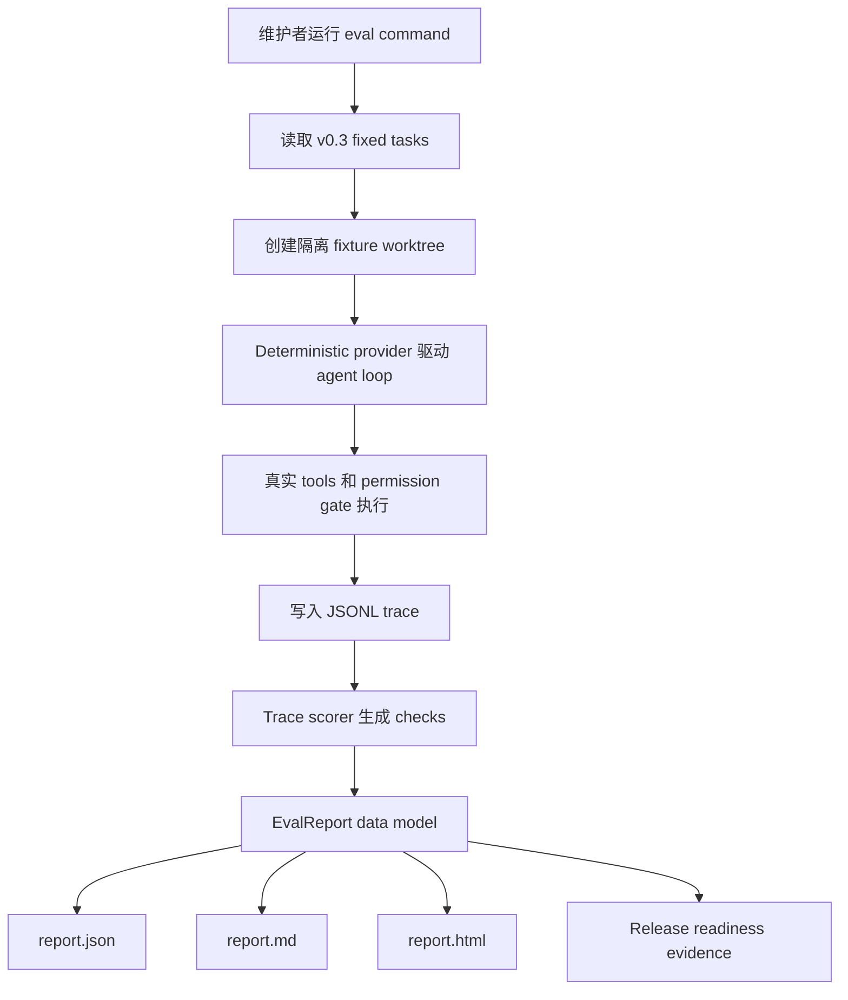

# v0.3.0 Evaluation Harness 发布说明

## 摘要

v0.3.0 把 release evidence 从零散的 smoke、unit tests 和人工 checklist，收敛为一个本地、确定性、可复查的 evaluation harness。维护者现在可以运行固定的 v0.3 task matrix，让 deterministic provider 走真实 agent loop、工具 registry、permission gate 和 JSONL trace，再由 scorer 输出 JSON、Markdown 和 self-contained HTML reports。

本版本回答的核心问题是：既有 read-only、patch 和 safety 行为是否仍然成立。它不做 leaderboard、托管服务、LLM judge、live provider ranking、context engineering、memory、delegation、sandbox 或 MCP。

## 功能验收卡

| 功能                           | 用户需求 / 主场景                                                                                | 行业实践                                                                                         | 本项目方案                                                                                                                        | 选择原因                                                                       | 实现路径                                                                                                               | E2E 验收                                                                                                   | Benchmark                                                   | 限制                                                                |
| ------------------------------ | ------------------------------------------------------------------------------------------------ | ------------------------------------------------------------------------------------------------ | --------------------------------------------------------------------------------------------------------------------------------- | ------------------------------------------------------------------------------ | ---------------------------------------------------------------------------------------------------------------------- | ---------------------------------------------------------------------------------------------------------- | ----------------------------------------------------------- | ------------------------------------------------------------------- |
| Fixed task eval                | 维护者需要用固定任务发现 agent 行为回归。主场景是在 release 前运行一组本地 deterministic tasks。 | OpenAI Evals、Aider leaderboard 和 OpenHands benchmarks 都先固定输入和指标。                     | v0.3 定义 4 个 P0 tasks：inspection、patch approval、patch denial、command policy denial。                                        | 小型固定矩阵能先覆盖本项目最核心行为，不把 release 扩大成通用 benchmark 平台。 | `getV03EvalTasks` 定义 task matrix；`runEvaluation` 顺序执行并汇总结果。                                               | `bun run eval -- --suite v0.3 --out .agent-harness/evals/latest` 生成 4/4 pass。                           | `taskPassRate` 为 100%。                                    | deterministic provider 不代表 live model 表现。                     |
| Trace scoring                  | reviewer 需要知道 agent 是怎样通过或失败，而不只看最终回答。                                     | opencode 和 Claude Code 都把权限、工具和自动化输出作为可观察边界；Hermes Agent 强调 trajectory。 | scorer 解析 JSONL trace，检查 required events、tool calls、permission decisions、tool errors、final answer 和 worktree evidence。 | trace-first 能把安全边界和工具行为纳入 regression signal。                     | `parseJsonlTrace` 读取 trace；`buildChecks` 生成 deterministic checks；`EvalCheckResult` 记录 evidence。               | eval run 为每个 task 写入 `.agent-harness/evals/latest/traces/*.jsonl`。                                   | `requiredCheckPassRate` 为 100%，`traceParseRate` 为 100%。 | 第一版只评分现有 trace metadata，不新增 runtime observability API。 |
| JSON / Markdown / HTML reports | 维护者需要机器可读结果、线性 review 文档和可浏览的 release evidence。                            | OpenClaw 强调 JSON 输出；`skill-hub` 显示 JSON 优先、HTML 渲染同一数据模型的工作报告边界。       | 同一 `EvalReport` 写出 `report.json`、`report.md` 和 `report.html`。                                                              | JSON 保持自动化契约，Markdown 适合 diff/review，HTML 适合本地证据浏览。        | `writeReports` 先构建脱敏 data model，再调用 `renderMarkdownReport` 和 `renderHtmlReport`。                            | eval run 生成 `.agent-harness/evals/latest/report.json`、`report.md` 和 `report.html`。                    | `report_completeness` 为 pass。                             | HTML 是本地 artifact，不是 dashboard 或 hosted service。            |
| Report privacy                 | release evidence 可能被贴进 issue、PR 或截图，不能暴露本机路径、用户名或 secret。                | 成熟 agent/eval 系统通常把 trace artifact 和可分享报告分离。                                     | 输出报告前统一做路径脱敏、token-looking secret 扫描和 HTML escaping。                                                             | 本地 artifact 也应默认可分享，避免把 reviewer 证据变成隐私风险。               | `redactReportPrivateText`、`findReportPrivacyLeaks` 和 `assertNoReportPrivacyLeaks` 约束 JSON、Markdown 和 HTML 输出。 | `scripts/eval-harness.test.ts` 覆盖隐私扫描；eval report 路径为 repo-relative 或 `[external-output]/...`。 | `report_privacy` 为 pass。                                  | scanner 是启发式边界，不替代人工审查敏感业务内容。                  |
| Release log HTML data          | reviewer 需要在 HTML report 中看到 release timeline，而不是只跳回 `CHANGELOG.md`。               | release report 常把 changelog 摘要作为发布证据入口。                                             | v0.3 从 `CHANGELOG.md` 解析 version、date、status、sections 和 items，并渲染进 HTML report。                                      | release evidence 和变更记录放在同一浏览 artifact 中，能减少人工查找。          | `parseReleaseLogMarkdown` 生成 `ReleaseLogSummary`；`renderHtmlReport` 渲染 release log 区。                           | 生成的 `report.md` 显示 3 releases / 30 items，HTML report 包含 release log 数据。                         | `release_log_html` 为 pass。                                | 解析器支持当前 changelog 格式，不是通用 Markdown release parser。   |

## 本次变更图



## 关键逻辑和代码定义

| 逻辑               | 代码定义                                                                          | 位置                           | 说明                                                                                        |
| ------------------ | --------------------------------------------------------------------------------- | ------------------------------ | ------------------------------------------------------------------------------------------- |
| CLI 入口           | `runEvalCli`                                                                      | `scripts/eval-harness.ts`      | 解析 `--suite` 和 `--out`，运行 eval 并输出 summary。                                       |
| Bun entrypoint     | default top-level call                                                            | `scripts/eval.ts`              | `bun run eval` 调用 `runEvalCli(process.argv.slice(2))`。                                   |
| 固定 task matrix   | `getV03EvalTasks`, `validateEvalTasks`, `EvalTask`                                | `scripts/eval-harness.ts`      | 定义 v0.3 P0 tasks、schema、排序和 expected checks。                                        |
| Eval orchestration | `runEvaluation`, `runEvalTask`                                                    | `scripts/eval-harness.ts`      | 创建输出目录、隔离 fixture worktree、运行 agent、收集结果。                                 |
| Trace parser       | `parseJsonlTrace`                                                                 | `scripts/eval-harness.ts`      | 读取 JSONL trace，保留可解析 events 和 parse errors。                                       |
| Report contract    | `EvalReport`, `EvalTaskResult`, `EvalCheckResult`                                 | `scripts/eval-harness.ts`      | 统一 JSON、Markdown、HTML 三种输出的数据模型。                                              |
| Markdown report    | `renderMarkdownReport`                                                            | `scripts/eval-harness.ts`      | 渲染 task matrix、failed checks、benchmark metrics、evidence 和 limitations。               |
| HTML report        | `renderHtmlReport`, `escapeHtml`                                                  | `scripts/eval-harness.ts`      | 渲染 self-contained HTML，支持 status filter、展开/折叠和失败摘要复制。                     |
| Release log parser | `parseReleaseLogMarkdown`, `ReleaseLogSummary`                                    | `scripts/eval-harness.ts`      | 从 `CHANGELOG.md` 解析 release timeline 并注入 report data model。                          |
| Report privacy     | `redactReportPrivateText`, `findReportPrivacyLeaks`, `assertNoReportPrivacyLeaks` | `scripts/eval-harness.ts`      | 输出前扫描绝对路径、用户目录和 token-looking secrets。                                      |
| 覆盖测试           | `v0.3 eval harness` test suite                                                    | `scripts/eval-harness.test.ts` | 覆盖 task matrix、report generation、trace parsing、HTML escaping、release log 和 privacy。 |

## 为什么这样实现

v0.3 选择本地 deterministic harness，而不是外部 benchmark 或 LLM judge。原因是本项目当前最需要的是 release regression signal：固定任务是否仍能通过，trace 是否可解析，permission/tool/worktree 边界是否仍符合预期，报告是否能支撑 review。

拒绝的替代方案：

- 只扩展 `bun run smoke`：smoke 能证明一条 happy path，但不能表达 task matrix、per-check evidence 或 report contract。
- 直接接入 SWE-bench / OpenHands benchmarks：行业相关，但依赖和运行成本过高，且会推迟本项目 trace scoring 闭环。
- Aider-style leaderboard：指标结构有价值，但公开排名和跨模型公平性不是 v0.3 目标。
- LLM judge：能评估自然语言质量，但第一版会降低 regression signal 的可复现性。
- HTML dashboard：HTML report 只做本地 artifact，不引入 server、远端上传或产品 UI。

## 行业方案对照

| 项目                        | 公开方案                                                             | 本项目方案                                                                            | 原因                                             |
| --------------------------- | -------------------------------------------------------------------- | ------------------------------------------------------------------------------------- | ------------------------------------------------ |
| OpenAI Codex / OpenAI Evals | 非交互 agent run、traces 和 eval loop 支撑自动化改进。               | 复用 scriptable local eval 思路，但只跑 deterministic provider 和本地 trace scoring。 | 先建立可重复 release gate，不引入 hosted eval。  |
| Claude Code                 | SDK/headless/structured output 支持自动化和 observability。          | 输出 JSON report 作为机器契约，成本和 latency 只记录可采集字段。                      | 避免猜测 live provider metrics。                 |
| opencode                    | terminal-first CLI 和 permissions 是行为边界。                       | 将 permission events、tool calls 和 policy denial 纳入 checks。                       | 安全回归必须从 trace 中可定位。                  |
| Aider                       | leaderboard 记录 pass rate、成本、超时、格式错误等指标。             | 借鉴指标结构，记录 local benchmark metrics，不做排名。                                | 保持 release scope 小且可复现。                  |
| OpenHands                   | benchmark infra 独立于主产品，覆盖多套大型任务。                     | v0.3 只做小型本地 harness，外部 benchmark 放到 later。                                | 先验证本项目自己的 trace/report contract。       |
| OpenClaw                    | one-shot CLI 支持 `--json` 输出，诊断和结果分离。                    | `report.json` 是 primary machine contract，Markdown/HTML 只做 review artifacts。      | 维持 script-friendly 边界。                      |
| Hermes Agent                | batch trajectory、memory、skills、subagents 支撑 research workflow。 | 保留 trace/trajectory 可评分方向，不引入 memory、skills 或 subagents。                | 避免把 v0.3 扩大成平台能力。                     |
| skill-hub                   | JSON 优先，HTML 渲染同一数据模型，报告自包含。                       | HTML report 渲染 `EvalReport`，不重新评分、不依赖网络。                               | 补齐本地 reviewer artifact，同时保留 JSON 契约。 |

## E2E 验收

| 场景                | 命令 / 步骤                                                      | Fixture / 输入                              | 预期证据                                                                     | 结果                                 |
| ------------------- | ---------------------------------------------------------------- | ------------------------------------------- | ---------------------------------------------------------------------------- | ------------------------------------ |
| Full v0.3 eval      | `bun run eval -- --suite v0.3 --out .agent-harness/evals/latest` | v0.3 fixed task matrix                      | 生成 JSONL traces、隔离 worktrees、`report.json`、`report.md`、`report.html` | pass，4/4 tasks 和 51/51 checks 通过 |
| Inspection eval     | 同上                                                             | `fixtures/tiny-ts-repo`                     | final answer grounded to `package.json` 和 `src/index.ts`，trace parse pass  | pass                                 |
| Patch approval eval | 同上                                                             | temporary patch repo                        | `apply_patch` 被批准，`src/index.ts` 更新，无 staged diff，无新 commit       | pass                                 |
| Safety denial eval  | 同上                                                             | patch denial 和 command policy denial tasks | unsafe patch / command 被拒绝，无 unexpected write                           | pass                                 |
| Report review       | 打开 `.agent-harness/evals/latest/report.html`                   | 生成的 HTML report                          | 非空、status filter、expand/collapse、release log 数据可见                   | pass                                 |

## Benchmark

| 问题                                                                                 | 指标                                                                             | 数据集 / fixture                    | 命令 / artifact                              | 阈值                                                           | 结果     | 限制                                   |
| ------------------------------------------------------------------------------------ | -------------------------------------------------------------------------------- | ----------------------------------- | -------------------------------------------- | -------------------------------------------------------------- | -------- | -------------------------------------- |
| Harness 能否用 deterministic trace evidence 发现固定 coding-agent tasks 的行为回归？ | `taskPassRate`                                                                   | v0.3 P0 task matrix                 | `.agent-harness/evals/latest/report.json`    | 100%                                                           | 100%     | 不是 public ranking。                  |
| 同上                                                                                 | `requiredCheckPassRate`                                                          | 51 required checks                  | `.agent-harness/evals/latest/report.json`    | 100%                                                           | 100%     | check set 只覆盖 v0.3 scope。          |
| trace 是否足够支撑 scoring？                                                         | `traceParseRate`                                                                 | 4 条 generated JSONL traces         | `.agent-harness/evals/latest/traces/*.jsonl` | 100%                                                           | 100%     | 不声明完整 observability。             |
| safety regression 是否能被定位？                                                     | `safetyDenialRate`, `unexpectedWriteCount`                                       | patch denial、command policy denial | `.agent-harness/evals/latest/report.json`    | 100% / 0                                                       | 100% / 0 | 只覆盖当前 unsafe fixtures。           |
| report 是否足以支持 release readiness？                                              | `report_completeness`, `html_review_smoke`, `report_privacy`, `release_log_html` | JSON / Markdown / HTML reports      | `.agent-harness/evals/latest/report.*`       | pass                                                           | pass     | HTML 是本地 artifact。                 |
| peer baseline 是否刷新？                                                             | practice comparison coverage                                                     | research note 和 technical report   | `docs/research/v0.3/evaluation-harness.md`   | Codex、Claude Code、opencode 和 release-relevant peers covered | pass     | 对照公开实践，没有执行同一 benchmark。 |

## 演示

```bash
bun install
bun run eval -- --suite v0.3 --out .agent-harness/evals/latest
```

## 质量证据

| 命令                                                             | 结果 | 备注                                                                                                     |
| ---------------------------------------------------------------- | ---- | -------------------------------------------------------------------------------------------------------- |
| `bun run eval -- --suite v0.3 --out .agent-harness/evals/latest` | pass | 2026-05-13 运行，4/4 tasks、51/51 checks、生成 JSON/Markdown/HTML reports。                              |
| `bun run audit:language`                                         | pass | 2026-05-13 运行，Markdown 英文正文 blocker 为 0，源码注释 blocker 为 0。                                 |
| `bun run format:check`                                           | pass | `bun run quality` 中通过。                                                                               |
| `bun run lint`                                                   | pass | `bun run quality` 中通过。                                                                               |
| `bun run typecheck`                                              | pass | `bun run quality` 中通过。                                                                               |
| `bun run build`                                                  | pass | `bun run quality` 中通过。                                                                               |
| `bun run test`                                                   | pass | `bun run quality` 中通过。                                                                               |
| `bun run smoke`                                                  | pass | `bun run quality` 中通过。                                                                               |
| `bun run quality`                                                | pass | 2026-05-13 运行通过。                                                                                    |
| Playwright HTML browser smoke                                    | pass | 2026-05-13 打开本地 `report.html`，验证窄 viewport、status filter、expand/collapse 和 0 console errors。 |

## 已知限制

- v0.3 使用 deterministic provider，不代表 live provider benchmark。
- 不做 leaderboard、线上服务、dashboard、remote report upload 或 public ranking。
- 不做 LLM judge，不评价自然语言质量。
- 不引入 context engineering、memory、delegation、sandbox、MCP 或 IDE extension。
- 不自动 stage、commit、push、tag、publish 或创建 PR。
- HTML report 是 self-contained local artifact，不是产品 UI。
- report privacy scanner 是启发式扫描，不能替代人工敏感信息审查。
- peer baseline 是公开实践对照，不是同题执行结果。

## 下一步

- 将 v0.3 release readiness evidence 作为后续 release 的基线。
- 在 v0.4 context engineering 前，先明确哪些新 trace events 或 metrics 需要进入 eval report。
- 如需 live provider benchmark，先补 research/spec，明确成本、API key、失败归因和隐私边界。

## 发布核对

| 项目               | 状态     | 备注                                                                          |
| ------------------ | -------- | ----------------------------------------------------------------------------- |
| Release note       | complete | 本文档记录 v0.3 功能、验收、benchmark、quality 和限制。                       |
| Ralph PRD          | complete | `scripts/ralph/prd.json` 三个 v0.3 stories 均完成。                           |
| HTML change report | complete | `.agent-harness/reports/latest/change-report.html` 已按开发完成汇报规范生成。 |
| Tag                | not run  | 本轮不自动 tag。                                                              |
| Publish            | not run  | 本轮不自动 publish。                                                          |
| Commit / push / PR | not run  | 需用户另行明确要求。                                                          |
