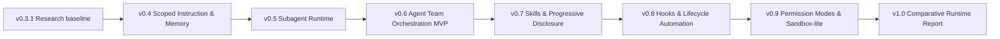

# Comparative agent runtime matrix

本矩阵把 Claude Code / Codex 的公开机制映射到 `code-agent-harness` 后续 release。矩阵描述的是 research baseline，不是当前 runtime capability claim。

调研刷新日期：2026-05-14。

## Scope

- `Claude Code public behavior`：只基于 Claude Code 官方文档和可观察产品文档。
- `Codex public behavior`：只基于 OpenAI Developers Codex 官方文档和本仓库已配置的 Codex project guidance。
- `code-agent-harness planned abstraction`：本项目后续 release 准备复现的最小可验证抽象。
- `Current status`：本仓库当前状态。若无法由当前文件或代码确认，标注 `needs verification`。

## Matrix

| Mechanism                                | Claude Code public behavior                                                                                                                     | Codex public behavior                                                                                                                                    | code-agent-harness planned abstraction                                                                                         | Current status                                                                                                                 | Target release                 | Key evidence to collect                                                                                  |
| ---------------------------------------- | ----------------------------------------------------------------------------------------------------------------------------------------------- | -------------------------------------------------------------------------------------------------------------------------------------------------------- | ------------------------------------------------------------------------------------------------------------------------------ | ------------------------------------------------------------------------------------------------------------------------------ | ------------------------------ | -------------------------------------------------------------------------------------------------------- |
| instructions / `AGENTS.md` / `CLAUDE.md` | `CLAUDE.md` project memory、user memory、local memory 和 managed memory 可进入会话；嵌套文件会按工作路径加载。                                  | `AGENTS.md` 在 Codex 工作前加载；全局 guidance、project guidance 和更近目录的 guidance 形成 instruction chain。                                          | repo-local instruction loader，记录 scope、precedence、source path、load reason 和 truncation。                                | 开发侧已有 `AGENTS.md`；产品 runtime instruction loader 未实现。                                                               | v0.4                           | instruction precedence fixtures、loaded instruction trace、conflict handling cases。                     |
| scoped memory                            | `CLAUDE.md`、`CLAUDE.local.md` 和 rules 具备层级和路径作用域；`/memory` 可查看加载状态。                                                        | Codex memories 是本地 recall layer；团队强制规则仍应放在 `AGENTS.md` 或 checked-in docs。                                                                | 显式、可审查、repo-local memory inputs；默认不引入隐藏 user profile。                                                          | 未实现。                                                                                                                       | v0.4                           | memory inclusion/exclusion trace、scope boundary fixture、compaction reload behavior notes。             |
| auto memory / memory proposal            | Claude Code auto memory 可保存用户要求记住的偏好，plain markdown 可审计；具体 proposal UI contract 需要 release 前复查。                        | Codex memories 可在后台从 eligible prior threads 生成本地 memory files，并提供 thread-level controls；memory proposal UI contract needs verification。   | 先复现 explicit memory review 和 opt-in load；auto generation 仅作为 later research，不进第一版 runtime。                      | 未实现；memory proposal 细节 needs verification。                                                                              | v0.4 research decision / later | generated memory provenance、redaction checks、manual review flow、opt-out trace。                       |
| subagents                                | Custom subagents 有独立 context、system prompt、tool permissions；可 foreground/background 运行并返回结果。                                     | Codex 可按显式请求 spawn subagents，支持并行、等待结果、合并回复；custom agents 可有独立 instructions/model/sandbox config。                             | deterministic subagent runner，限定输入输出、context isolation、result summary 和 parent-child trace link。                    | 未实现。                                                                                                                       | v0.5                           | subagent spawn/stop trace、child context snapshot、permission inheritance case、failed subtask summary。 |
| agent teams / orchestration              | Experimental agent teams 使用 lead、teammates、shared task list 和 mailbox；disabled by default 且有恢复和 shutdown 限制。                      | Codex docs 描述 subagent orchestration 和 Building AI Teams 学习入口；更重的 team abstraction 需要 release 前复查。                                      | task list state、role assignment、mailbox messages、progress events、final aggregation。                                       | 未实现。                                                                                                                       | v0.6                           | team task transcript、mailbox delivery trace、stale task recovery、coordination overhead notes。         |
| skills / progressive disclosure          | Claude Code 文档显示 subagents 和 agent teams 会加载 project context、MCP servers 和 skills；skill-specific public contract 需 release 前复查。 | Skills 由 `SKILL.md` metadata、可选 scripts/references/assets 组成；Codex 先看到 metadata，选择后再加载完整 `SKILL.md`。                                 | repo-local skill manifest、metadata-first discovery、explicit load trace、missing/blocked skill fallback。                     | 开发侧已有 `.agents/skills`；产品 runtime skills 未实现。                                                                      | v0.7                           | skill discovery list、loaded file list、context budget comparison、script execution approval events。    |
| hooks / lifecycle automation             | Hooks 可配置在 settings 或 subagent frontmatter，覆盖 tool use、session、stop、instructions-loaded 等生命周期；shell command 有安全风险。       | Codex hooks 支持 session/tool/prompt/stop events，hook input/output 通过 JSON 和 exit code 控制；PreToolUse 是 guardrail 不是完整 enforcement boundary。 | explicit lifecycle hooks：pre-run、post-edit、pre-final、post-report；每个 hook 有 dry-run、trace、timeout 和 failure policy。 | 产品 runtime hooks 未实现；开发侧已有 HTML handoff skill。                                                                     | v0.8                           | hook run trace、blocked/skipped reason、timeout case、hook-generated artifact reference。                |
| permission modes                         | Claude Code permissions 可允许、询问或拒绝工具和命令；subagents/teams 继承或受限于会话权限。                                                    | Codex sandbox modes 和 approval policies 暴露 read-only、workspace-write、danger-full-access、on-request、never 等组合；rules 可控制 sandbox 外命令。    | repo-local permission profile、command/edit risk classification、approval prompt evidence 和 per-action audit trail。          | 部分实现：v0.1/v0.2 已有 tool default permission、permission gate 和 `permission.requested/decided` trace；完整 modes 未实现。 | v0.9                           | permission matrix tests、denied action traces、approval prompt snapshots、policy override cases。        |
| sandbox-lite                             | Claude Code docs 强调权限、worktrees 和 hooks；agent teams 不自动隔离 worktree，需任务分区。                                                    | Codex sandboxing 文档描述 workspace boundary、writable roots、network/file profiles 和 full access 风险。                                                | path boundary、writable roots、read deny patterns、network policy placeholder 和 limitation notes。                            | 部分路径 safety 在 tools 中存在；sandbox-lite runtime 未实现。                                                                 | v0.9                           | path traversal tests、repo boundary denial、writable roots cases、network denied events。                |
| trace and eval                           | Claude Code docs 暴露 transcript、hooks input、agent/team状态等 observability entrypoints；具体 trace schema 不作为本项目事实来源。             | Codex docs 与 cookbook 强调 traces/evals/agent improvement loop；Codex subagents 和 hooks有可观察事件。                                                  | JSONL event trace、deterministic eval harness、HTML/Markdown/JSON reports、release evidence index。                            | 已实现 v0.1 JSONL trace 和 v0.3 eval harness；后续机制需扩展事件。                                                             | 已有 / 每个后续 release / v1.0 | required events coverage、trace parse rate、privacy redaction、release comparative report。              |

## Release sequencing

## Sources

| Source                                                    | Type          | Used for                                                                                |
| --------------------------------------------------------- | ------------- | --------------------------------------------------------------------------------------- |
| <https://code.claude.com/docs/en/memory>                  | official docs | Claude Code `CLAUDE.md`、auto memory、`/memory` 和 instruction loading observations。   |
| <https://code.claude.com/docs/en/sub-agents>              | official docs | Claude Code subagent context、tools、foreground/background 和 patterns。                |
| <https://code.claude.com/docs/en/agent-teams>             | official docs | Claude Code experimental agent teams、lead/teammates/task list/mailbox 和 limitations。 |
| <https://code.claude.com/docs/en/hooks>                   | official docs | Claude Code hooks event model、exit code/JSON controls 和 security concerns。           |
| <https://developers.openai.com/codex/guides/agents-md>    | official docs | Codex `AGENTS.md` discovery and precedence。                                            |
| <https://developers.openai.com/codex/memories>            | official docs | Codex memories generation、storage、thread controls 和 privacy cautions。               |
| <https://developers.openai.com/codex/skills>              | official docs | Codex skills structure、discovery 和 progressive disclosure。                           |
| <https://developers.openai.com/codex/subagents>           | official docs | Codex subagent workflows、custom agents、approval/sandbox inheritance。                 |
| <https://developers.openai.com/codex/hooks>               | official docs | Codex hook events、input/output 和 limitations。                                        |
| <https://developers.openai.com/codex/concepts/sandboxing> | official docs | Codex sandbox modes、approval policies、writable roots 和 permission controls。         |
| <https://developers.openai.com/codex/rules>               | official docs | Codex command rules and sandbox boundary exceptions。                                   |
