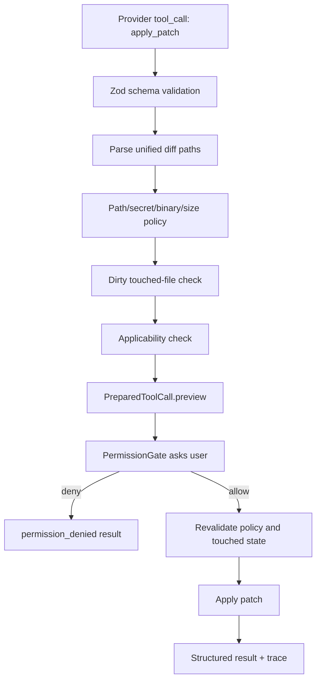

# Spec: Edit/Patch Approval Workflow

## 范围分类

`later release`，目标 release 为 `v0.2.0`。

本文档是设计和实现计划，不授权直接编码。实现前需要 alignment brief 被确认。

## 问题

v0.1 的 agent 只能读取仓库。v0.2 要让 agent 能提出并应用代码修改，但不能牺牲已有安全边界。写入能力必须满足：

- 用户能在写入前看到 diff 预览；
- 用户能明确批准或拒绝；
- policy deny 不能被用户批准覆盖；
- 不覆盖用户已有未提交工作；
- trace 能解释 patch 请求、批准、应用和失败。

## 用户可见行为

- 当 agent 想修改文件时，它调用 `apply_patch` 工具提交 unified diff。
- CLI 在写入前展示：
  - 修改文件列表；
  - diffstat；
  - 风险摘要；
  - 截断后的 unified diff preview；
  - approve/deny 操作提示。
- 用户批准后，patch 应用到工作区，但不会自动 stage、commit、push。
- 用户拒绝后，工作区不变，agent 收到结构化 denied result。
- patch policy 失败时不出现 approval prompt，直接返回结构化错误。
- 最终回答必须列出实际修改文件和未运行/已运行的验证命令。

## 内部设计

v0.2 的 patch tool flow：



`packages/tools` 负责 patch 解析、policy 和实际应用。`packages/core` 负责把 tool preflight 的 preview metadata 传给 permission gate。`apps/cli` 只负责渲染 preview 和收集用户决定。

## API / 契约

新增或扩展 core contract：

```ts
export interface ToolPreview {
  title: string;
  summary: JsonObject;
  body?: string;
  truncated?: boolean;
}

export interface PreparedToolCall {
  callId: string;
  toolName: string;
  input: JsonObject;
  defaultPermission: PermissionDecision;
  preview?: ToolPreview;
}

export interface PermissionRequest {
  runId: string;
  callId: string;
  toolName: string;
  input: JsonObject;
  reason?: string;
  preview?: ToolPreview;
}
```

新增 tool：

```ts
export const applyPatchTool: ToolDefinition<ApplyPatchInput>;
```

输入 schema：

```ts
const ApplyPatchInputSchema = z
  .object({
    patch: z.string().min(1).max(200_000),
    cwd: z.string().default("."),
    maxPreviewBytes: z.number().int().min(1).max(50_000).default(20_000)
  })
  .strict();
```

输出形状：

```ts
interface ApplyPatchOutput {
  applied: boolean;
  files: Array<{
    path: string;
    status: "added" | "modified" | "deleted";
    additions: number;
    deletions: number;
  }>;
  previewTruncated: boolean;
}
```

## 数据和状态模型

Patch preflight 需要派生：

- touched paths；
- path statuses；
- additions/deletions；
- diffstat；
- preview body；
- policy warnings；
- dirty touched-file status；
- applicability status。

Trace event data 必须 bounded：

- `patch.requested`：tool name、file count、patch bytes；
- `permission.requested`：preview metadata，不写完整大 diff；
- `permission.decided`：allow/deny；
- `patch.applied`：files、additions、deletions；
- `patch.failed`：error kind、policy reason。

如果不新增事件类型，也必须在现有 `tool.started`、`permission.requested`、`permission.decided`、`tool.completed` data 中记录等价 metadata。

## 错误处理

| 情况                      | Error kind                |
| ------------------------- | ------------------------- |
| Invalid input schema      | `tool_validation_error`   |
| Patch parse failure       | `tool_validation_error`   |
| Path escape               | `path_policy_violation`   |
| Secret-looking path       | `secret_policy_violation` |
| Binary/mode/symlink patch | `patch_policy_violation`  |
| Patch too large           | `patch_policy_violation`  |
| Too many files            | `patch_policy_violation`  |
| Touched file dirty        | `patch_policy_violation`  |
| Patch does not apply      | `patch_policy_violation`  |
| User denied               | `permission_denied`       |
| Apply execution failure   | `tool_execution_error`    |
| User abort                | `aborted`                 |

如果当前 `AgentErrorKind` 不包含 `patch_policy_violation`，v0.2 需要新增该 kind，或明确复用 `tool_execution_error` / `path_policy_violation` 的边界。推荐新增 `patch_policy_violation`，避免把预期 policy denial 混为执行故障。

## 权限和安全考虑

- `apply_patch` 默认 permission 为 `ask`。
- permission prompt 只能在 schema 和 deterministic policy 通过后出现。
- 用户批准不能覆盖以下 deny：
  - repo 外路径；
  - symlink escape；
  - secret-looking path；
  - binary/mode/symlink patch；
  - patch size/file count 超限；
  - touched files 已 dirty；
  - patch 不可 clean apply。
- 执行前必须重新检查 touched-file dirty 状态，避免 approval 等待期间工作区变化。
- `apply_patch` 不得自动 stage、commit、push。
- 不扩展 `run_command` 的写命令 allowlist。
- trace 不能包含 secret 内容或完整超大 diff。

## 测试计划

Core tests：

- permission request receives preview metadata；
- denied patch does not execute；
- abort during patch approval does not write；
- patch events or equivalent tool/permission events are logged；
- final state includes applied or denied tool result。

Tools tests：

- accepts a small valid text patch；
- rejects invalid patch syntax；
- rejects extra input fields；
- rejects path traversal；
- rejects symlink escape；
- rejects secret-looking path；
- rejects binary diff；
- rejects mode/symlink change；
- rejects patch over byte limit；
- rejects too many files；
- rejects dirty touched files；
- rejects non-applicable patch；
- applies approved patch and reports files/additions/deletions；
- does not stage or commit。

CLI tests：

- renders patch preview summary；
- approve key applies；
- deny key does not apply；
- abort key during approval does not apply；
- long preview is truncated with visible marker。

Smoke：

- fixture task reads repo, proposes one small patch, user approval path can be exercised deterministically with mock provider/test adapter。

## 文档影响

实现时必须更新：

- `docs/agent/tool-protocol.md`
- `docs/agent/permission-system.md`
- `docs/architecture/v0.1-minimal-coding-agent.md` 或新增 v0.2 architecture doc
- `docs/engineering/testing-strategy.md`
- `docs/releases/v0.2.0.md`
- README 的 current release 和 limitations
- CHANGELOG

## 验收标准

本 spec 被接受的条件：

- `docs/releases/v0.2.0-contract.md` 已定义 patch-capable scope；
- research note 已记录外部方案和取舍；
- readiness gap list 已列出 P0 blockers；
- alignment brief 明确推荐 `apply_patch` 方案；
- 用户确认后才能进入实现。

实现完成条件：

- 所有 Functional acceptance 和 Safety acceptance 通过测试覆盖；
- `bun run quality` 通过；
- release note 按中文发布文档标准完成；
- 没有引入 auto-commit、push、background write、sandbox claim、MCP 或 memory。

## 非目标

- `write_file` 整文件覆写工具；
- 自动 commit/stage/push/PR；
- sandbox runtime；
- background patch application；
- persistent approval memory；
- conflict resolution UI；
- binary patch；
- rename/mode/symlink patch；
- model-driven arbitrary shell writes；
- MCP tool bridge。

## 推进计划

1. 更新 core types，加入 preview metadata 和 `patch_policy_violation`。
2. 在 tools 包实现 patch parser/preflight/apply policy。
3. 添加 `applyPatchTool`，默认 `ask`，注册到默认工具集。
4. 更新 agent loop，把 `PreparedToolCall.preview` 传给 `PermissionGate`。
5. 更新 CLI permission prompt，渲染 patch preview 和截断标记。
6. 添加 core/tools/cli 测试和 deterministic smoke。
7. 更新 README、architecture、tool/permission docs、release note 和 checklist。
8. 运行完整质量门禁。
