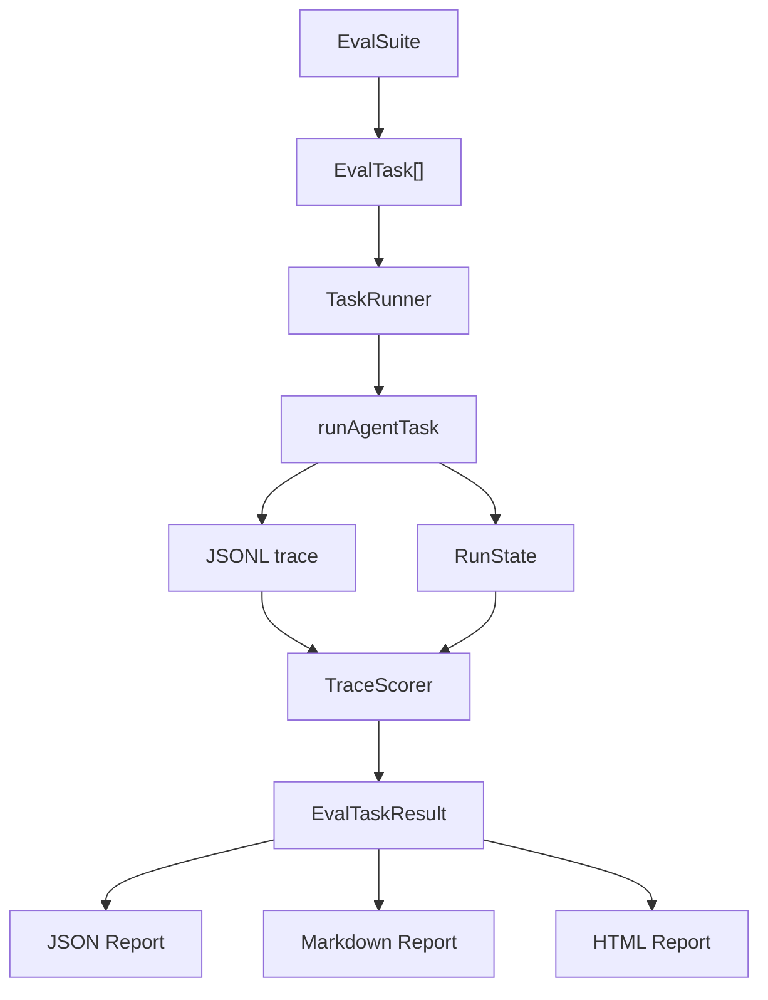

# 规格：v0.3 Evaluation Harness

## Scope classification 分类

`later release`，对应 `docs/roadmap.md` 中 `v0.3 Evaluation Harness`。本 spec 是 implementation 前规划，不开始产品代码实现。

P0 scope：

- 固定 fixture tasks；
- 执行 deterministic agent run；
- 读取 JSONL trace；
- 做 deterministic checks；
- 输出本地 JSON / Markdown / HTML report；
- 记录 pass/fail、evidence、limitations。

Explicit non-goals：

- leaderboard；
- online service；
- LLM judge；
- live provider ranking；
- 上下文工程、记忆、委派、沙箱、MCP。

## 问题

当前 release evidence 证明了若干路径能通过，但没有统一 harness 判断行为是否回归。v0.3 要把“现有行为是否仍然成立”变成可执行、可报告、可 review 的本地评估流程。

## 用户可见行为

实现后，维护者应能运行一个本地 eval command，得到：

- 每个 fixture task 的 pass/fail；
- 每个 deterministic check 的结果和失败原因；
- trace path、report path 和 worktree evidence；
- metrics summary；
- 未运行项和 limitations。
- 可在浏览器打开的 self-contained HTML report，用于 release review、失败定位和证据浏览。

示例目标形态：

```bash
bun run eval -- --suite v0.3 --out .agent-harness/evals/latest
```

命令名是建议，不是本轮已实现事实。

## 内部设计



P0 implementation boundaries：

- `scripts` 或 future `packages/core` helper 可以负责 eval orchestration。
- `runAgentTask`、default tool registry、mock/deterministic provider 和 JSONL event logger 继续作为真实执行路径。
- scorer 不依赖 provider SDK shape。
- report writer 不改变 TUI。
- HTML report 只渲染 report data model，不新增评分逻辑，不依赖网络资源，不演变为 dashboard。
- mutable tasks 使用 temp git repo 或 fixture copy，不能污染 `fixtures/` 源文件。

## API / 契约

### Eval task definition

建议 schema：

```ts
type EvalTask = {
  id: string;
  title: string;
  category: "inspection" | "patch" | "safety" | "trace";
  repoFixture: string;
  prompt: string;
  providerFixture: string;
  maxSteps: number;
  expected: {
    finalAnswerIncludes?: string[];
    requiredTraceEvents?: string[];
    requiredToolCalls?: string[];
    deniedToolCalls?: string[];
    modifiedFiles?: string[];
    unchangedFiles?: string[];
    noStagedChanges?: boolean;
    noNewCommit?: boolean;
  };
};
```

### Eval result

```ts
type EvalTaskResult = {
  taskId: string;
  status: "pass" | "fail" | "error";
  runId?: string;
  tracePath?: string;
  checks: EvalCheckResult[];
  metrics: {
    stepCount?: number;
    toolCallCount?: number;
    permissionRequestCount?: number;
    deniedCount?: number;
    durationMs?: number | null;
  };
  evidence: {
    reportPath?: string;
    tracePath?: string;
    worktreePath?: string;
  };
  limitations: string[];
};
```

### Check result

```ts
type EvalCheckResult = {
  id: string;
  status: "pass" | "fail" | "not_run";
  message: string;
  evidence?: Record<string, unknown>;
};
```

### Report contract

JSON report P0 fields：

- `schemaVersion`
- `generatedAt`
- `suiteId`
- `gitHead`
- `taskResults`
- `totals`
- `metrics`
- `limitations`
- `notRun`
- `releaseLog`

Markdown report P0 sections：

- summary；
- task matrix；
- failed checks；
- evidence paths；
- benchmark metrics；
- limitations；
- commands run。

HTML report P0 rules：

- HTML report 是 reviewer-facing artifact，不是机器契约；JSON report 仍是 tests、CI 和 wrapper 的 primary contract。
- HTML report 必须从同一 report data model 渲染，不能重新计算 pass/fail 或隐藏 JSON 中的失败项。
- release log 数据来自 `CHANGELOG.md`，必须解析为 version、date、status、section、item count 和 item list，并从同一 report data model 渲染到 HTML。
- 输出为 self-contained `.html`，默认无网络依赖，包含 inline CSS/JS。
- 必须包含 summary、task matrix、failed checks、evidence paths、benchmark metrics、limitations、commands run 和 release log 数据。
- 必须提供至少一种 HTML-native 审查能力：按 status 过滤、失败项折叠/展开、task jump links 或复制失败摘要。
- 必须对所有来自 trace、tool output、final answer 和 file path 的内容做 HTML escaping。
- 不写 raw secret、raw oversized output 或完整大 diff；如需 trace excerpt，只展示 bounded metadata。
- 报告数据和渲染结果严禁包含本机绝对路径、用户主目录、系统用户名或 token-looking secret；路径必须是 repo-relative path 或 `[external-output]/...`。
- JSON、Markdown 和 HTML 三个实际输出写入前都必须通过 report privacy scan。
- read-only eval 只写到显式 output directory；不得创建隐藏状态、上传报告或写入 repo 外部服务。

## 数据 / 状态模型

Trace scorer 读取现有 `TraceEvent` JSONL，不要求 raw diff 或 secret content。P0 scorer 只使用现有事件和 bounded metadata：

- `run.started`
- `tool.requested` 或等价 tool call evidence；
- `permission.requested`
- `permission.decided`
- `tool.completed`
- `run.completed`
- `run.failed`
- `run.aborted`

如果某个事件当前不存在或命名不同，implementation story 应先基于真实 `TraceEvent` 类型校准 spec，并在 report 中记录 missing evidence，而不是伪造事件。

## 错误处理

- task definition schema invalid：eval command fail fast，report 可不生成。
- 单个 task run failed：该 task 标为 `error`，suite 继续运行后续 tasks。
- trace missing：task fail，check reason 记录 `trace_missing`。
- JSONL parse error：task fail，记录行号和错误摘要。
- expected file missing：对应 worktree check fail。
- unsupported expected field：schema validation fail，而不是 silent ignore。
- no live provider key：live provider tasks 标记 `not_run`，不得影响 P0 deterministic suite。

## 权限 / 安全考虑

- eval runner 不得扩展 `run_command` allowlist。
- eval runner 不得自动 stage、commit、push。
- mutable fixture 必须复制到 temp dir 或创建 temp git repo。
- safety tasks 必须断言 unsafe request 被拒绝且无 unexpected write。
- report 不写 secret、raw oversized output、完整大 diff、本机绝对路径、用户主目录、系统用户名或 token-looking secret。
- 如果 report 包含 trace excerpt，必须只引用 bounded metadata 或脱敏内容。

## 测试计划

| 层级      | 覆盖                                                                                                                     |
| --------- | ------------------------------------------------------------------------------------------------------------------------ |
| 单元测试  | task schema 校验、JSONL parser、check functions、release log parser、report totals、HTML escaping、report privacy scan。 |
| 集成测试  | deterministic provider、真实 tool registry 和临时 fixture repo。                                                         |
| E2E       | eval command 执行 suite，并写入 JSON / Markdown / HTML report。                                                          |
| Browser   | HTML report 可打开、非空、窄 viewport 不重叠、核心过滤/折叠控件可用。                                                    |
| Benchmark | 固定 task matrix 通过率、trace 解析率和 safety denial rate。                                                             |

P0 tests：

- invalid task schema rejected；
- JSONL parser 能处理多个 events 和 parse error；
- inspection task 要求 final answer grounding；
- patch approval task 验证修改文件和 no staged diff；
- safety denial task 验证 no write；
- report writer 包含 totals、failed checks、limitations；
- HTML report writer 转义 evidence/final answer/release log，并渲染完整 required sections。

## E2E 验收计划

| 场景                 | Fixture / input                     | Expected evidence                                                                                                           |
| -------------------- | ----------------------------------- | --------------------------------------------------------------------------------------------------------------------------- |
| Inspection eval      | `fixtures/tiny-ts-repo`             | final answer 包含 `package.json` / `src/index.ts`；trace parse check 通过。                                                 |
| Patch approval eval  | 包含 `src/index.ts` 的临时 git repo | patch applied；permission preview 存在；no staged diff；report task 通过。                                                  |
| Safety denial eval   | unsafe command 或 unsafe patch      | policy violation result；无 file change；report 记录 denial check 通过。                                                    |
| Trace completeness   | generated JSONL traces              | required events 存在；缺失 events 会造成 deterministic failure。                                                            |
| Report generation    | full P0 suite                       | JSON、Markdown 和 HTML reports 写入 totals、metrics、limitations、evidence paths、release log，并通过 report privacy scan。 |
| HTML review artifact | generated HTML report               | 浏览器打开非空；status filter 或 collapse 控件可用；窄 viewport 无明显重叠。                                                |

## Benchmark 计划

Primary benchmark question：

```txt
Can the harness detect behavior regressions across fixed coding-agent tasks using deterministic trace evidence?
```

Metrics：

| Metric                     | Definition                                                                      | Threshold |
| -------------------------- | ------------------------------------------------------------------------------- | --------- |
| `task_pass_rate`           | 通过任务数 / P0 总任务数                                                        | 100%      |
| `required_check_pass_rate` | 通过 required checks 数 / required checks 总数                                  | 100%      |
| `trace_parse_rate`         | 可解析 traces 数 / generated traces 总数                                        | 100%      |
| `safety_denial_rate`       | 被拒绝的预期 unsafe requests / unsafe task 请求数                               | 100%      |
| `unexpected_write_count`   | expected mutable files 外的写入次数                                             | 0         |
| `report_completeness`      | JSON / Markdown / HTML required report sections 存在比例                        | 100%      |
| `html_review_smoke`        | HTML report browser smoke 是否通过                                              | pass      |
| `report_privacy`           | JSON / Markdown / HTML report 是否不含绝对路径、用户信息或 token-looking secret | pass      |
| `release_log_html`         | HTML report 是否呈现 release log timeline 和条目数据                            | pass      |

Peer baseline：

- OpenAI Codex / OpenAI Evals：traces + eval loop 是改进闭环信号。
- Claude Code：headless / SDK / observability 信号支持机器可读 automation。
- opencode：terminal-first 和 permissions 应进入 scoring。
- Aider：固定 benchmark、pass rate、cost、timeout、format errors 说明指标需要结构化。
- OpenHands：benchmark infra 可独立于主产品，但大型外部 benchmark 是 later。
- OpenClaw：`--json` 和 stdout/stderr 分离说明 script-friendly report 是必要边界。
- Hermes Agent：batch trajectories 有研究价值，但 memory/skills/subagents 不进入 v0.3。

本项目 v0.3 只做 practice comparison，不做 executed peer comparison。

## 文档影响

实现阶段需要更新：

- `docs/agent/evaluation-strategy.md`
- `docs/engineering/testing-strategy.md`
- `docs/checklists/v0.3-readiness-gap-list.md`
- `docs/specs/v0.3/eval-report-privacy.md`
- future `docs/releases/v0.3.0.md`
- README / CHANGELOG，如公开命令或 workflow 变化

## 验收标准

- 固定 task schema 和 fixture task definitions 存在并有 tests。
- eval runner 能执行 P0 suite。
- scorer 基于 generated JSONL trace 和 worktree evidence 做 deterministic checks。
- report 输出 JSON、Markdown 和 HTML。
- report 失败时能定位 task id、check id、reason 和 evidence path。
- HTML report 是自包含本地 artifact，支持 reviewer 快速定位失败和证据，不依赖网络、不上传、不改变评分结果。
- P0 benchmark metrics 有真实结果，未运行项标记为 `not_run`。
- 不引入 non-goals。

## 非目标

- 不做 online service、dashboard 或 leaderboard。
- 不做 LLM judge。
- 不做 live provider benchmark 作为 P0。
- 不引入 context engineering、memory、delegation、sandbox、MCP。
- 不自动提交、推送或发布。

## Rollout 计划

1. `story-1-task-schema-fixtures`：定义 task schema 和 P0 tasks。
2. `story-2-trace-parser-checks`：实现 JSONL parser 和 deterministic checks。
3. `story-3-runner`：执行 deterministic agent runs 和 isolated fixture setup。
4. `story-4-report-writer`：输出 JSON / Markdown reports，建立单一 report data model。
5. `story-5-html-report`：从同一 data model 渲染 self-contained HTML report，并补浏览器 smoke。
6. `story-6-release-evidence`：更新 docs、readiness、quality gate 和 benchmark evidence。

每个 story 都应先补 tests，再实现，并保持可独立 review。
