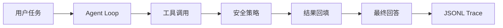

# vX.Y.Z <Release Name>

## 摘要

说明本次 release 解决的用户问题、核心交付和适用边界。

## 功能清单

| 功能 | 用户价值 | 关键入口 | 限制 |
| ---- | -------- | -------- | ---- |
|      |          |          |      |

## 本次变更图



## 关键逻辑和代码定义

| 逻辑 | 代码定义 | 位置 | 说明 |
| ---- | -------- | ---- | ---- |
|      |          |      |      |

## 为什么这样实现

说明当前方案、拒绝的替代方案、取舍原因，以及这些取舍如何匹配本 release 的 scope。

## 行业方案对照

| 项目         | 公开方案 | 我们的方案 | 原因 |
| ------------ | -------- | ---------- | ---- |
| OpenAI Codex |          |            |      |
| Claude Code  |          |            |      |
| opencode     |          |            |      |
| OpenClaw     |          |            |      |
| Hermes Agent |          |            |      |

## 演示

```bash
bun install
bun run build
```

## 质量证据

| 命令                   | 结果   | 备注 |
| ---------------------- | ------ | ---- |
| `bun run format:check` | 未运行 |      |
| `bun run lint`         | 未运行 |      |
| `bun run typecheck`    | 未运行 |      |
| `bun run build`        | 未运行 |      |
| `bun run test`         | 未运行 |      |
| `bun run smoke`        | 未运行 |      |
| `bun run quality`      | 未运行 |      |

## 已知限制

## 下一步

## 发布核对

记录 tag、commit SHA、未完成事项和人工审核结论。
